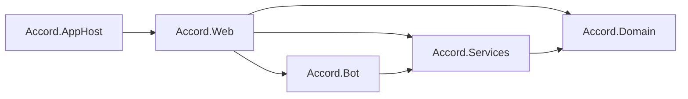
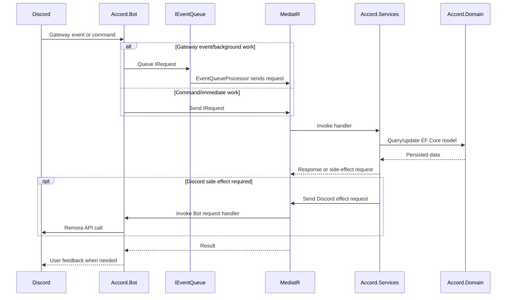

# How do I contribute

Accord is actively developed with both Rider and Visual Studio. It is recommended you use either IDE for a positive experience. However, Accord is built entirely on .NET and therefore works anywhere `dotnet build` can be executed.

You can grab an unassigned issue and comment on it to indicate your interest on championing it. Alternatively, if you have a suggestion for a new feature and want to champion this, create a new issue and it can be discussed in the repository.

Please do not submit pull requests without prior conversation with maintainers in the repository. Your contribution may not be accepted, as ultimately it has to be maintained through, potentially, the lifetime of this codebase.

## Development ethos

Keep things short, simple and maintainable. No pointless abstractions or complicated chains. Move fast, break and innovate. This is a Discord bot first and foremost and it strives for simplicity.

## Quickstart

**What you'll need**

- [Latest .NET SDK](https://dotnet.microsoft.com/en-us/download)
- [Aspire CLI](https://aspire.dev/get-started/install-cli/)
- Docker
- [Discord Bot](https://discord.com/developers/applications)

**How to get Accord running in development**

- Set up a bot account on the [Discord developer portal](https://discord.com/developers/applications)
    - Ensure you have the following priviledged gateway intents enabled:
        - Presence Intent
        - Server Members Intent
- Clone/fork the repository from `main` branch
- Get the Id of the Discord Guild you will be testing the bot in, for the purposes of Slash command updating
- Get your bot token from the [Discord developer portal](https://discord.com/developers/applications)
- Run via Aspire `Accord.AppHost`, set up the parameters as you see fit

**Invite your bot**

(Change your client Id to that of your application's)

```https://discord.com/oauth2/authorize?client_id=CLIENT_ID&scope=bot%20applications.commands&permissions=1573252310```

This ensures the bot has the minimum required permissions and can manage Slash commands on the guild.

Start via `Accord.AppHost`. This will apply migrations automatically via Entity Framework.

## Architecture

Accord is a self-hosted, single-guild Discord bot built with .NET. It combines a Remora-based Discord bot, application workflows handled through MediatR, EF Core persistence, and a small Blazor web frontend.

Core goal: keep Discord transport concerns thin and replaceable. Bot code adapts Discord events and commands into application requests. Business workflows live behind MediatR request handlers. Services are not directly invoked from Discord responders or command groups when crossing project boundaries.

### Project Roles

#### `Accord.Web`

`Accord.Web` is the executable application for normal hosting.

It owns ASP.NET Core startup and composition:

- Registers MediatR handlers from `Accord.Bot` and `Accord.Services`.
- Starts Discord bot hosted services when `Discord:BotToken` is configured.
- Runs database migrations at startup.
- Runs `EventQueueProcessor`, which drains queued requests.

Web-specific Discord code is limited to web authentication and UI support. It should not become the place where bot workflows live.

#### `Accord.Bot`

`Accord.Bot` owns the Discord integration.

It contains:

- Remora gateway setup, command registration, and responder registration.
- Discord command groups.
- Gateway event responders.
- Hosted services that interact with Discord.
- Discord formatting, cache, command context, and permission helper code.
- MediatR handlers that perform Discord-side effects, such as kicking a guild member or deleting a Discord message.

`Accord.Bot` is an adapter layer. It translates Discord events, interactions, and API calls into internal requests and responses.

The bot may depend on `Accord.Services` because it needs request contracts and DTOs. Other projects must not depend on Remora types unless they are part of the Discord adapter itself.

#### `Accord.Services`

`Accord.Services` owns application workflows and business logic.

It contains:

- MediatR request and handler pairs.
- Request/response DTOs used across adapters.
- Helpers that are not tied to Remora, such as snowflake, avatar, and date helpers.

This layer can use `Accord.Domain` for persistence. It must not use Remora or Discord.NET gateway/rest abstractions directly. Discord-specific behavior should be expressed as request contracts, then handled by `Accord.Bot` when a Discord API call is required.

#### `Accord.Domain`

`Accord.Domain` owns persistence.

It contains:

- EF Core `AccordContext`.
- Domain model entities.
- EF Core migrations and model snapshot.

This project has no dependency on bot, web, or service adapters. It should stay focused on database shape and persistent model rules.

#### `Accord.AppHost`

`Accord.AppHost` owns local orchestration through .NET Aspire.

It defines:

- PostgreSQL container/resource.
- Web project hosting.
- Environment variables and parameters for Discord, Sentry, PostgreSQL, and the optional REPL service.
- Docker Compose publishing names and resource wiring.

It is not part of runtime business logic. It exists to make local development and deployment composition repeatable.

### Dependency Direction

Current dependency flow:



```text
Accord.AppHost -> Accord.Web
Accord.Web -> Accord.Bot
Accord.Web -> Accord.Services
Accord.Web -> Accord.Domain
Accord.Bot -> Accord.Services
Accord.Services -> Accord.Domain
Accord.Domain -> external EF Core packages only
```

Rules:

- `Accord.Domain` does not reference application, bot, or web projects.
- `Accord.Services` references `Accord.Domain`, not `Accord.Bot`.
- `Accord.Bot` references `Accord.Services` for request contracts and application DTOs.
- Discord adapter types from `Accord.Bot` do not leak into `Accord.Services` or `Accord.Domain`.
- UI and hosting code in `Accord.Web` composes the system but should not own core bot workflows.

### Boundaries

Project boundaries are intentional and should not be crossed casually.

`Accord.Bot` boundary:

- Converts Remora gateway events and slash/prefix commands into MediatR requests.
- Sends user feedback and Discord API calls.
- Handles Discord-specific concerns: embeds, modals, interaction responses, snowflake conversion, gateway intents, command attributes, Discord permissions, and Remora result types.
- Must not contain persistence-heavy business workflows when those workflows can live in `Accord.Services`.

`Accord.Services` boundary:

- Owns use cases and business decisions.
- Uses EF Core through `Accord.Domain`.
- Exposes workflows as MediatR request records.
- May define request contracts for Discord-side effects, but should not implement those effects with Remora.

`Accord.Domain` boundary:

- Owns persisted entities and EF Core context configuration.
- Must not know about MediatR, Remora, ASP.NET, or hosting.

`Accord.Web` boundary:

- Owns host startup, DI composition, authentication, and web UI.
- Should call workflows through MediatR rather than reaching through to low-level services where possible.

### Cross-boundary communication



Typical inbound flow:

```text
Discord event/command
-> Accord.Bot responder or command group
-> MediatR request or queued MediatR request
-> Accord.Services handler
-> Accord.Domain persistence
```

Typical Discord side-effect flow:

```text
Accord.Services workflow
-> MediatR request contract, for example KickRequest
-> Accord.Bot request handler
-> Remora Discord API call
```

This keeps coupling thin. `Accord.Services` can ask for an effect by sending a request, without knowing Remora implementation details. `Accord.Bot` can be swapped from Remora to another Discord library with less impact because Discord-library-specific code is concentrated in the adapter project.

Do not inject and call application services directly from Discord bot code when crossing into application workflows. Prefer `IMediator.Send(...)` or `IEventQueue.Queue(...)` with request records.

### Event Queue

`IEventQueue` provides async buffering for gateway-driven work.

Gateway events can be high-volume or should return quickly. Responders enqueue `IRequest` instances instead of doing all work inline. `EventQueueProcessor` runs as a hosted service, creates a DI scope per item, resolves `IMediator`, optionally ensures users exist for `IEnsureUserExistsRequest`, and sends the queued request.

Use queued requests for event-driven background work where Discord gateway response speed matters. Use direct `IMediator.Send(...)` for command flows where the user expects an immediate response.

### Dependency Injection

Use AutoRegisterInject for application service registration.

Preferred attributes:

- `[RegisterScoped]` for scoped services that depend on EF Core context or request scope.
- `[RegisterSingleton]` for stateless singleton infrastructure such as the event queue.
- `[RegisterTransient]` when a new instance per resolution is needed.

Avoid manual DI registration unless framework integration requires it, such as Remora setup, hosted services, EF Core, authentication, HTTP clients, or UI services.

### C# Style And Conventions

General conventions:

- Nullable reference types are enabled.
- Package versions are centrally managed in `Directory.Packages.props`.
- Use modern C# where appropriate, including primary constructors.
- Prefer `var` when type is apparent or local type detail does not improve readability.
- Use built-in C# type keywords such as `string`, `int`, and `bool` instead of BCL aliases in normal code.
- Constants use all-uppercase naming with underscores when needed.
- Keep accessibility modifiers explicit for non-interface members.
- Use pattern matching and null propagation where they simplify code.

MediatR conventions:

- Request and response models should be `sealed record` types.
- Request names should describe the use case, usually ending in `Request`.
- Handlers should stay near their request type when practical.
- Request contracts that need user preloading can implement `IEnsureUserExistsRequest`.
- Use `ServiceResponse` or `ServiceResponse<T>` for workflows that can fail with user-facing validation messages.

Layering conventions:

- New Discord commands belong in `Accord.Bot.CommandGroups`.
- New Discord gateway event handlers belong in `Accord.Bot.Responders`.
- New application workflows belong in `Accord.Services` under a feature folder.
- New persisted entities belong in `Accord.Domain.Model` and `AccordContext`.
- Database model changes require migrations, but migrations should be created intentionally by the developer rather than generated as part of unrelated work.

### Swapping Discord Libraries

Remora is an implementation detail of `Accord.Bot`.

To keep that true:

- Keep Remora types out of `Accord.Services` and `Accord.Domain`.
- Use plain DTOs, primitive Discord IDs, and MediatR requests across boundaries.
- Put Discord API calls behind Bot-side handlers.
- Keep command/responder logic thin and delegate application decisions to Services.
- Avoid making Services depend on Discord command context, interaction context, embeds, modals, or Remora result types.

With those constraints, replacing Remora would mostly mean rewriting `Accord.Bot`: gateway setup, command registration, responders, command groups, helper adapters, and Discord API handlers. Core workflows, persistence, and most web hosting code should remain intact.