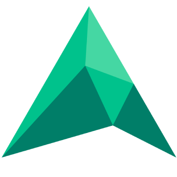

# Accord
<p align="center">
    
</p>

## Reach accord, prevent discord, on Discord.

A C# .NET 7 Discord bot with moderation, XP/guild participation and utilities aimed at all users within a guild. This is not a hosted bot, it is intended to be self hosted.

### How do I contribute

Accord is actively developed with both Rider and Visual Studio 2022. It is recommended you use either IDE for a positive experience. However, Accord is built entirely on .NET 7 and therefore works anywhere `dotnet build` can be executed.

You can grab an unassigned issue and comment on it to indicate your interest on championing it. Alternatively, if you have a suggestion for a new feature and want to champion this, create a new issue and it can be discussed in the repository.

**Development ethos**

Keep things short, simple and maintainable. No pointless abstractions or complicated chains. Move fast, break and innovate. This is a Discord bot first and foremost and it strives for simplicity.

**What you'll need**

- Latest .NET 7 SDK
- Postgres (Docker image available)
- Discord Bot account

**How to get Accord running in development**

- Set up a bot account on the [Discord developer portal](https://discord.com/developers/applications)
    - Ensure you have the following priviledged gateway intents enabled:
        - Presence Intent
        - Server Members Intent
- Clone/fork the repository from `main` branch
- Get the Id of the Discord Guild you will be testing the bot in, for the purposes of Slash command updating
- Get your bot token from the [Discord developer portal](https://discord.com/developers/applications)
- Set up configurations for development, using [user-secrets](https://docs.microsoft.com/en-us/aspnet/core/security/app-secrets)
    - `dotnet user-secrets set Discord:ClientId CLIENT_ID`
    - `dotnet user-secrets set Discord:ClientSecret CLIENT_SECRET`
    - `dotnet user-secrets set Discord:GuildId GUILD_ID`
    - `dotnet user-secrets set Discord:BotToken BOT_TOKEN`
- Optionally use the `dev.docker-compose.yml` file to get a local Postgres and pgadmin instance for development

By default the bot will look for a Postgres instance running on `localhost`. If your instance is not on `localhost` or has an otherwise differing connection string, set the `ConnectionStrings:Database` secret.

If you want to disable the Discord bot instance, for any reason, you can override `Discord:DisableBot` to `true`, which will only run the hosting ASP.NET Core project, skipping bot initialisation. Do note that several parts of the frontend require the bot to have a connection established.

**Invite your bot**

(Change your client Id to that of your application's)

```https://discord.com/oauth2/authorize?client_id=CLIENT_ID&scope=bot%20applications.commands&permissions=1573252310```

This ensures the bot has the minimum required permissions and can manage Slash commands on the guild.

Start the bot. This will apply migrations automatically via Entity Framework.

### How to self host

You can build from source or host via the published Docker image. An example `docker-compose.yml` is below.

```yml
version: '3.1'

services:
  postgres:
    image: postgres
    restart: always
    environment:
      POSTGRES_USER: ${POSTGRES_USER}
      POSTGRES_PASSWORD: ${POSTGRES_PASSWORD}
    ports:
      - '5432:5432'

  bot:
    image: ghcr.io/patrickklaeren/accord:main
    depends_on:
      - postgres
    restart: always
    environment:
      ConnectionStrings__Database: ${CONNECTIONSTRINGS_DATABASE}
      Discord__ClientSecret: ${DISCORD_CLIENTID}
      Discord__ClientId: ${DISCORD_CLIENTID}
      Discord__GuildId: ${DISCORD_GUILDID}
      Discord__BotToken: ${DISCORD_BOTTOKEN}
    ports:
      - '80:80'
      - '443:443'
```

**Requirements**
- Postgres
- Web host for ASP.NET Core

Set environment variables for `ConnectionStrings:Database`, `Discord:GuildId`, `Discord:BotToken`, `Discord:ClientId`, `Discord:ClientSecret`.

This bot is intended for single-guild usage.

### Credits

Notable dependencies for this project include:
- [Remora](https://github.com/Nihlus/Remora.Discord)
- [MediatR](https://github.com/jbogard/MediatR)
- [Entity Framework Core](https://docs.microsoft.com/en-us/ef/core/)
- [Npgsql EF Core Provider](https://www.npgsql.org/efcore/)
